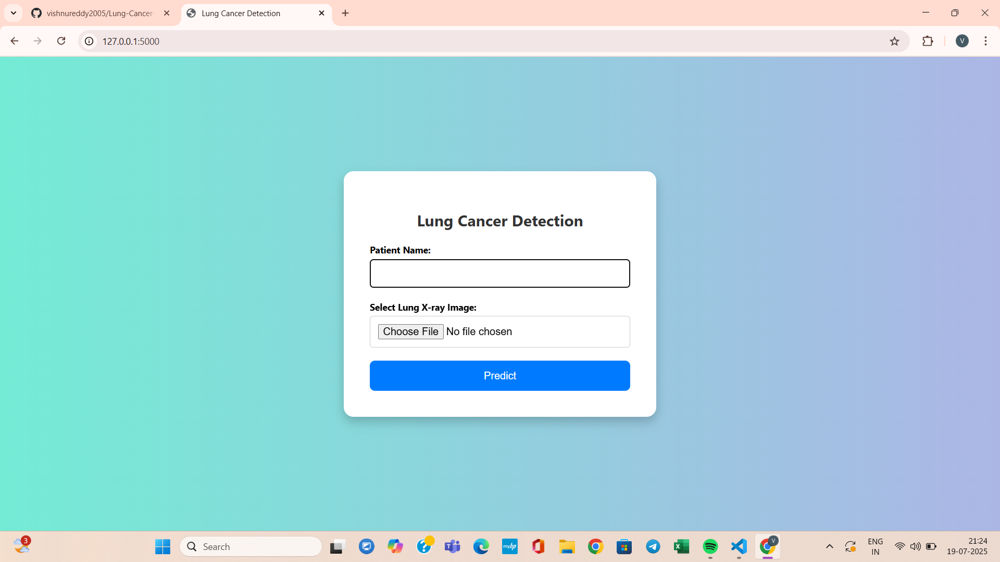
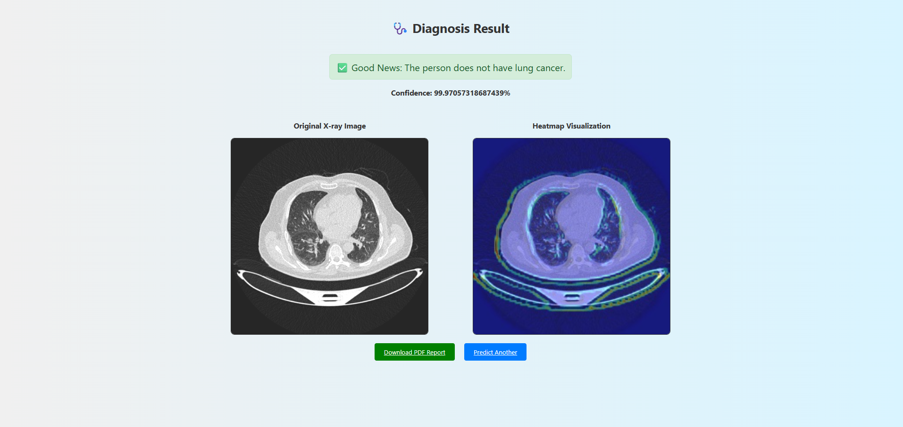
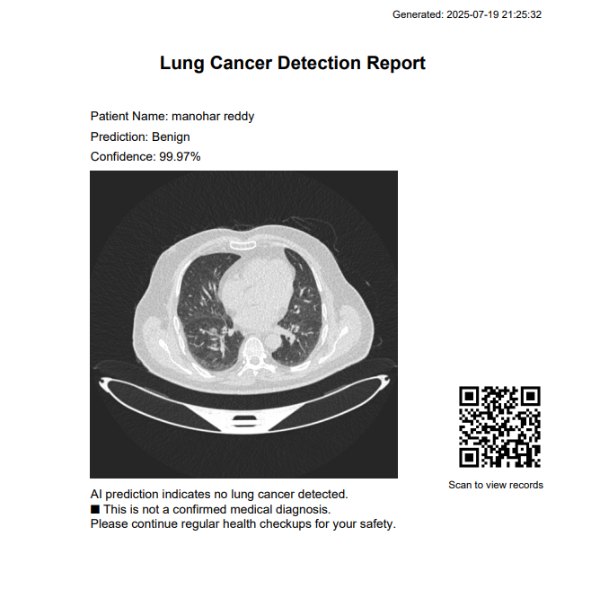

# 🩺 Lung Cancer Detection System

A **Lung Cancer Detection Web Application** using Deep Learning and Flask. This system enables users to upload lung CT scan images, predicts cancer presence, explains model predictions using Grad-CAM, and generates a downloadable PDF report.

---

## 📌 Key Features

- ✅ **Lung Cancer Detection** using a trained CNN (Convolutional Neural Network).
- ✅ **Grad-CAM Visualization** to highlight critical cancerous regions.
- ✅ **Automatic PDF Report Generation** after prediction.
- ✅ **Interactive Flask Web Interface**.
- ✅ **Preprocessing & Model Training Scripts** included.
- ✅ **Database Integration** to store patient records and results.

---

## 🛠️ Technologies Used

| Tool/Tech        | Purpose                          |
|------------------|----------------------------------|
| Python           | Core programming language        |
| Flask            | Web framework                    |
| TensorFlow/Keras | Deep learning model              |
| OpenCV           | Image processing                 |
| Grad-CAM         | Model explainability             |
| SQLite           | Database                         |
| PDFKit / ReportLab | PDF report generation         |
| HTML, CSS        | Frontend design                  |

---

## 📦 Project Structure

```
Lung Cancer Detection Project/
│
├── app.py                  # Main Flask app
├── train_model.py          # Model training script
├── gradcam.py              # Grad-CAM visualization logic
├── generate_pdf.py         # PDF report generator
├── split_dataset.py        # Dataset splitting tool
│
├── model/                  # Saved trained model files
├── dataset/                # Preprocessed dataset
├── lung_cancer/            # Custom image preprocessing
├── The IQ-OTHNCCD lung cancer dataset/   # Raw dataset
├── Test cases/             # Sample test images
├── static/                 # CSS, JS, and image assets
├── templates/              # HTML templates for web interface
└── requirements.txt        # Python dependencies
```

---

## 🚀 Running the Project

1. **Train the model:**
   ```bash
   python train_model.py
   ```

2. **Start the Flask server:**
   ```bash
   python app.py
   ```

3. **Open in browser:**
   ```
   http://127.0.0.1:5000/
   ```

---

## 📂 Dataset Download & Setup

- **Dataset:** [The IQ-OTH/NCCD Lung Cancer Dataset](https://drive.google.com/drive/folders/1Q4dzFZP-P5CLKX6XWonhQzs3_Ok2L5cL?usp=drive_link)

### 📝 Instructions:

1. Download the dataset from the link above.
2. Place it inside the project directory as:
   ```
   dataset/
   ```
3. Ensure folder structure matches with the code.

---

## 📚 Dataset Details

- **Name:** The IQ-OTH/NCCD Lung Cancer Dataset  
- **Type:** CT Scan Images  
- **Purpose:** Binary classification (Cancer / No Cancer)  
- **Usage:** Preprocessed and split using `split_dataset.py`

---

## 🔥 Grad-CAM (Heatmap) Visualization

### 🔎 What is Grad-CAM?
Grad-CAM (Gradient-weighted Class Activation Mapping) helps visualize which areas in a CT image contributed to the prediction.

### 🧠 Workflow:
1. Upload CT scan via Flask interface.
2. Model returns prediction.
3. Grad-CAM creates a heatmap over critical image regions.
4. Heatmap is overlaid on original image.
5. Result shown in browser and added to PDF.

```python
from gradcam import generate_gradcam, overlay_heatmap

heatmap = generate_gradcam(model, processed_image, 'last_conv_layer_name')
overlay_image = overlay_heatmap(uploaded_image_path, heatmap)
```

---

## 📄 PDF Report Generation

Each prediction generates a downloadable PDF using `ReportLab` or `PDFKit`, including:

- Patient Name
- Uploaded CT Image
- Prediction Result
- Grad-CAM Heatmap
- Timestamp

---

## ✅ Python Packages Used

- Flask
- TensorFlow / Keras
- OpenCV
- NumPy
- Pillow
- Matplotlib
- Pandas (optional)
- ReportLab / PDFKit
- SQLite3 (built-in)

---

## 📸 Screenshots

### 🩺 Patient Details


### 📈 Prediction Details


### 📄 PDF Report



---

## 👨‍💻 Author

**Vishnu Vardhan Reddy**  
*Computer Science Engineer | AI Enthusiast*
